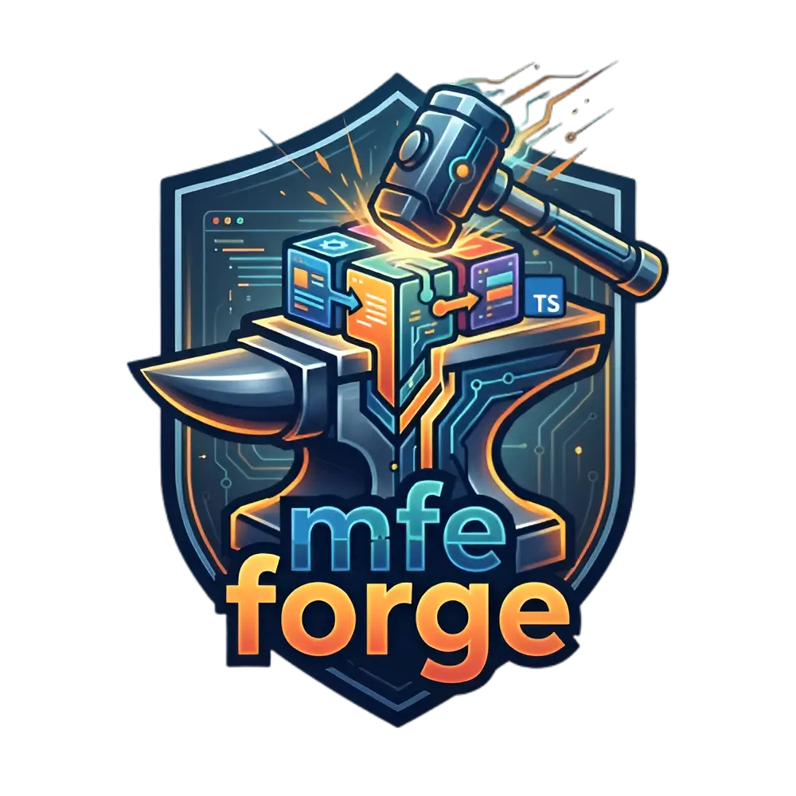

<p align="center">
  
</p>

# MFE Forge

[](https://www.npmjs.com/package/mfe-forge)
[](https://opensource.org/licenses/MIT)

> Production-ready Micro Frontend framework for Vite + React + Module Federation

MFE Forge is a comprehensive CLI and runtime framework that eliminates the boilerplate and complexity of building Micro Frontend architectures. It provides intelligent scaffolding, automatic host registration, development orchestration, and production-grade runtime utilities.

## Features

- 🚀 **Zero-config scaffolding** — Generate apps, hosts, packages, and design systems in seconds
- 🏗️ **Scope-based architecture** — Organize MFEs by team, product, or domain (`appname/auth`, `another_app/dashboard`)
- 🔌 **Auto-registration** — Hosts automatically discover and register remotes in their scope
- 🖥️ **Dev orchestration** — Run all MFEs with a single command
- 📝 **Type safety** — Automatic TypeScript declaration sync across MFEs
- 🧪 **Testing** — Built-in Vitest + Playwright configuration
- 🎨 **Design system** — Token-based theming with Tailwind CSS
- 🐳 **CI/CD ready** — Docker and GitHub Actions templates
- 📊 **Observability** — Error boundaries, event bus, and performance monitoring

## Quick Start

```bash
# Create new project
npx mfe-forge init my-project
cd my-project

# Generate a scoped app
npx mfe-forge generate app appname/dashboard

# Generate the host for that scope
npx mfe-forge generate host appname/host

# Start all MFEs
npm run dev
```

## Installation

### Global Installation

```bash
npm install -g mfe-forge
# or
pnpm add -g mfe-forge
# or
bun add -g mfe-forge
```

### Project-local Installation

```bash
npm install --save-dev mfe-forge
# or
pnpm add -D mfe-forge
# or
bun add -D mfe-forge
```

## CLI Commands

| Command                  | Alias | Description                                  |
| ------------------------ | ----- | -------------------------------------------- |
| `init [name]`            | —     | Initialize a new MFE Forge project           |
| `generate <type> [name]` | `g`   | Generate apps, hosts, packages, or libraries |
| `dev`                    | —     | Start development servers                    |
| `build [app]`            | —     | Build applications for production            |
| `test`                   | —     | Run tests across MFEs                        |
| `sync`                   | —     | Sync types, hosts, and routes                |
| `doctor`                 | —     | Diagnose common issues                       |
| `config`                 | —     | Manage configuration                         |

## Project Structure

```
my-project/
├── apps/
│   ├── appname/
│   │   ├── host/           # Host application
│   │   ├── auth/           # Auth MFE
│   │   └── dashboard/      # Dashboard MFE
│   └── another_app/
│       ├── host/
│       └── analytics/
├── packages/
│   ├── ui/                 # Shared UI components
│   ├── utils/              # Shared utilities
│   └── store/              # Shared state
├── mfeforge.config.ts      # Framework configuration
├── tsconfig.base.json      # Base TypeScript config
└── package.json
```

## Runtime Packages

- `@mfe-forge/core` — Error boundaries, event bus, remote loaders
- `@mfe-forge/router` — Cross-MFE routing coordination
- `@mfe-forge/store` — Shared Zustand stores with sync
- `@mfe-forge/design` — Design tokens and theming
- `@mfe-forge/testing` — Testing utilities for MFEs

## Documentation

📖 Full documentation: [https://d-rayno.github.io/mfe-forge/](https://d-rayno.github.io/mfe-forge/)

- [Getting Started](https://d-rayno.github.io/mfe-forge/getting-started)
- [CLI Reference](https://d-rayno.github.io/mfe-forge/cli)
- [Architecture Guide](https://d-rayno.github.io/mfe-forge/architecture)
- [Migration Guide](https://d-rayno.github.io/mfe-forge/migration)
- [Publishing Guide](https://d-rayno.github.io/mfe-forge/publishing)

## License

MIT © [D-Rayno](https://github.com/D-Rayno)
